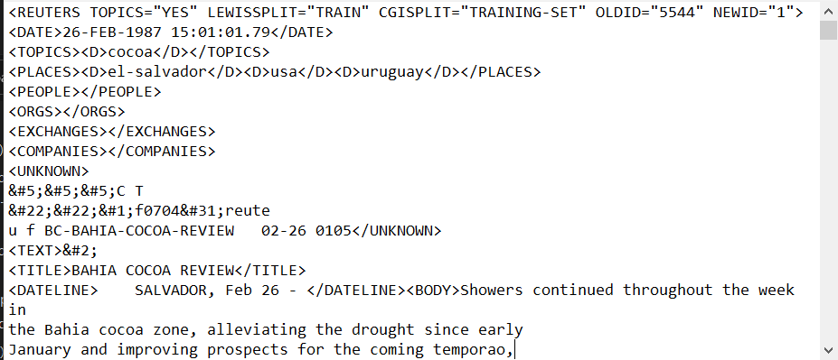

# Reuters News Classification

## System Information

- GPU model and Memory : Geforce GTX 1650
- CUDA Version         : 10.1
- Cudnn Version        : 7.6.5.32
- TF                   : 2.2
- Pandas               : 1.0.5
- Numpy                : 1.19.5

## Introduction

In this project, I will try to classify the news articles into one of the following classes:

• **acq**

• **crude**

• **earn**

• **grain**

• **interest**

• **money-fx**

• **money-supply**

• **others**

• **ship**

• **sugar**

• **trade**

We are using [Reuters-21578, Distribution 1.0](https://archive.ics.uci.edu/ml/machine-learning-databases/reuters21578-mld/) dataset for this problem.

## Understanding the Data

The data is in the form of a list of ‘.sgm’ files. Below is an image of how the files are structured. Each file contains 1000 News Articles.You can find more details
about it in the README file regarding the tags.

We have done a multiclass Classification here on **11** classes.

We have selected top **10** highest occurring topics and assigned topic **others** to the remaining articles.

To know more about the Preprocessing steps and methodology  please refer to the [Training Notebook](Training.ipynb) and the [Google Slides Presentation](Interos_Apprentice_Challenge.pptx)  
